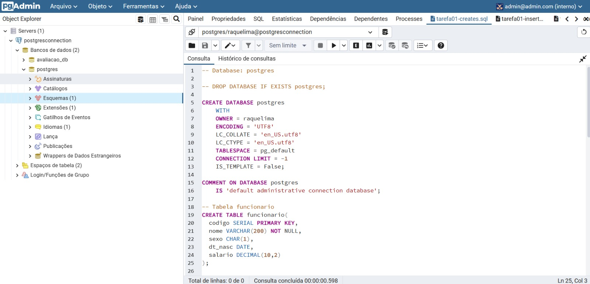
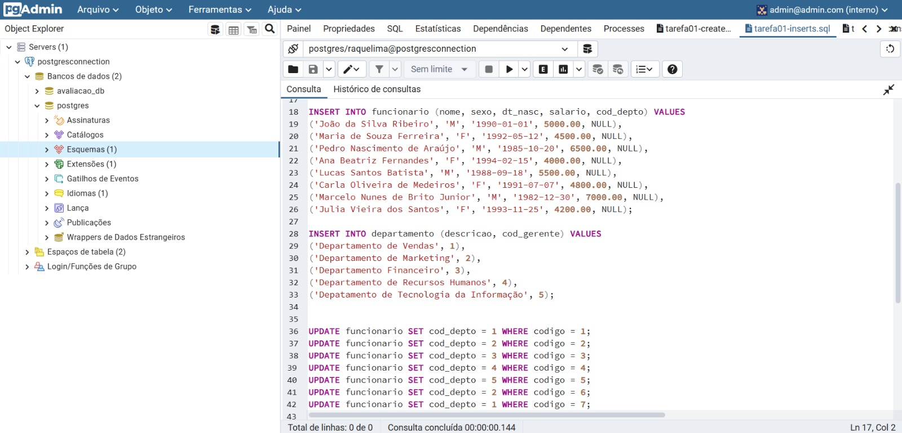
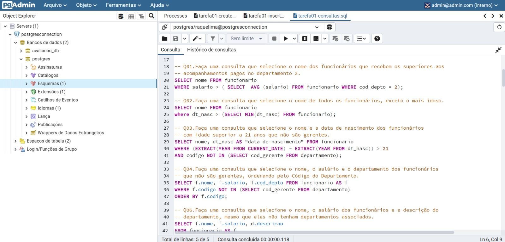

 

# Projeto e Administração de Banco de Dados

Repositório utilizado para as tarefas do componente curricular 'Projeto e Administração de Banco de Dados'.
 
Discente: Raquel Lima Fernandes  
Matrícula: 20190012546   
E-mail: raquel.lima.072@ufrn.edu.br

# Diretórios 

* [Tarefa 01](tarefas/t01/tarefa01.md) 
* [Tarefa 02](tarefas/t02/tarefa02.md) 
* [Tarefa 03](tarefas/t03/tarefa03.md) 

# Tecnologias utilizadas

    

         
        Docker compose  
    

     
    
O Docker Compose é uma ferramenta para a criação e execução de múltiplos containers de aplicação. Com o Compose, você pode usar um arquivo do tipo <em>yaml</em> para definir como será o ambiente de sua aplicação e usando um único comando você criará e iniciará todos os serviços definidos.
     
    Para utilizar o docker-compose é necessário seguir três etapas:
    

    <ul dir="auto">
        <li>
             Definir o ambiente necessário para sua aplicação utilizando um Dockerfile (que pode ser reproduzido em qualquer lugar que tenha Docker instalado);
        </li>
        <li>
            Definir no arquivo <em>.yml</em>  quais serviços são essenciais para sua aplicação e a relação entre elas;
        </li>
        <li>
            Executar o comando <em>docker-compose up</em> para que seu ambiente seja criado e configurado.
        </li>
    </ul>
    

    

         
        pgAdmin4  
    

     
    

        O pgAdmin é uma plataforma de administração e desenvolvimento de código aberto para o PostgreSQL. Com essa aplicação, você pode ter uma interface gráfica para gerenciar tudo relacionado ao PostgreSQL.
    

    
Utilizando a ferramenta:

    

        
        <figcaption align="center">Fonte: De autoria própria (create tables).</figcaption>
    

     
    

        
        <figcaption align="center">Fonte: De autoria própria (insert data).</figcaption>
    
  
      
    

        
        <figcaption align="center">Fonte: De autoria própria (consultas).</figcaption>
    
 

    

         
        PostgreSQL  
    

     
    

        O PostgreSQL é um sistema de gerenciamento de bancos de dados objeto-relacional de uso geral, um dos mais avançado sistema de banco de dados de código aberto. 
         
        Hoje, o PostgreSQL é um dos SGBDs (Sistema Gerenciador de Bancos de Dados) de código aberto mais avançados, contando com recursos como:
        <ul>
            <li>Consultas complexas;</li>
            <li>Chaves estrangeiras;</li>
            <li>Integridade transacional;</li>
            <li>Controle de concorrência multiversão;</li>
            <li>Suporte ao modelo híbrido objeto-relacional;</li>
            <li>Facilidade de Acesso;</li>
            <li>Gatilhos;</li>
            <li>Visões;</li>
            <li>Linguagem Procedural em várias linguagens (PL/pgSQL, PL/Python, PL/Java, PL/Perl) para Procedimentos armazenados;</li>
            <li>Indexação por texto;</li>
            <li>Estrutura para guardar dados Georreferenciados PostGIS.</li>
        </ul>
    

    

# Referências
1. [Docker Compose](https://docs.docker.com/compose/) acessado em 27/04/2023.  
2. [PgAdmin4](https://www.pgadmin.org/download/pgadmin-4-container/)  acessado em 28/04/2023.  
2. [PostgreSQL](https://www.youtube.com/watch?v=uKlRp6CqpDg) acessado em 28/04/2023.
4. [Repositório Tacianosilva/bsi-tasks](https://github.com/tacianosilva/bsi-tasks) acessado em 27/04/2023.
